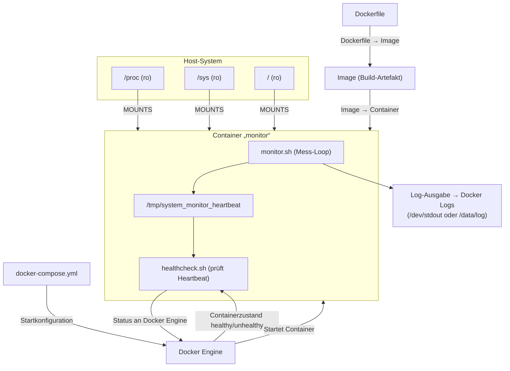
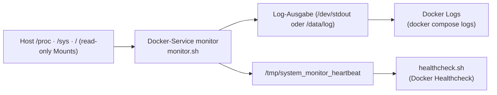

# System Monitor – Docker-basierte Hostüberwachung

Dieses Repository enthält einen leichtgewichtigen Docker-Container, der CPU-, RAM- und Festplattentrends des Host-Systems erfasst, protokolliert und per Healthcheck überwacht. Die Lösung ist bewusst minimal gehalten, sodass der komplette Stack – vom Bash-Skript über Dockerfile bis zur Compose-Orchestrierung – für Präsentationen nachvollzogen und erweitert werden kann.

## Erfüllte Basisanforderungen
| Anforderung | Umsetzung |
| --- | --- |
| Zyklisch formatierte Systemmetriken | `monitor.sh` erstellt alle `INTERVAL` Sekunden einen Bericht mit Zeitstempel, Hostname sowie CPU-/RAM-/Disk-Werten. |
| Spezielle Log-Dateien | Standardziel ist `/dev/stdout`; per `LOG_FILE=/data/system_monitor.log` (Volume notwendig) werden Messwerte persistiert. |
| Docker-Integration ohne Container-Scheuklappen | Bind-Mounts (`/proc`, `/sys`, `/`) liefern Host-Daten, damit der Container nicht seine eigene Sicht misst. |
| 60-Sekunden-Aktualisierung | `docker-compose.yml` setzt `INTERVAL: "60"` für den Grundbetrieb; kann für Live-Demos angepasst werden. |

## Zielsetzung & Funktionsumfang
- **Ziel**: Zuverlässige Grundüberwachung eines Hosts ohne zusätzliche Agenten oder Root-Prozesse im Container.
- **Funktionsumfang**:
  - zyklische Messung von CPU-, Arbeitsspeicher- und Datenträgerauslastung
  - Streaming der Messberichte auf `stdout` (`LOG_FILE=/dev/stdout`), abrufbar via `docker compose logs -f monitor`; optional schreibbar in eine Datei per ENV + Volume
  - Healthcheck, der sicherstellt, dass Messwerte kontinuierlich geschrieben werden
  - Konfigurierbares Messintervall und Pfadzuweisungen über Umgebungsvariablen
  - Container läuft als nicht privilegierter Benutzer `app`

## Architekturüberblick


Die Grafik trennt klar zwischen Build- und Laufzeit: Das Dockerfile erzeugt ein Image, das von der Docker Engine gestartet wird; `docker-compose.yml` liefert lediglich die Startkonfiguration. Die Log-Ausgabe ist neutral als „Docker Logs“ dargestellt, sodass klar wird, dass alle Konsumenten (Admins, Automationen, Kibana etc.) denselben Stream nutzen.

## Ordner- & Dateistruktur
| Pfad | Beschreibung |
| --- | --- |
| `Dockerfile` | Baut ein Alpine-Image, erstellt den Benutzer `app` und kopiert die Skripte.
| `docker-compose.yml` | Definiert den Service `monitor`, Mounts, Variablen und Healthcheck.
| `monitor.sh` | Kernskript, das Metriken ermittelt und als Bericht protokolliert.
| `healthcheck.sh` | Prüft über einen Heartbeat in `/tmp/system_monitor_heartbeat`, ob das Skript läuft.

## Komponenten & Services
| Service / Modul | Technologie | Zweck |
| --- | --- | --- |
| `monitor` | Docker Compose Service | Führt `monitor.sh` im Container aus und mountet Host-Datenquellen.
| `monitor.sh` | Bash + `/proc`, `df` | Liest Host-Metriken, formatiert die Ausgabe und schreibt in den konfigurierbaren Log-Stream.
| `healthcheck.sh` | Bash + `find` | Dient Docker als Healthcheck-Befehl via Heartbeat-Datei.
| Dockerfile | Alpine + Bash | Definiert die Laufzeitumgebung mit non-root Benutzer.
| Docker Compose | YAML | Startet den Container, injiziert Variablen und Volumes.

## Funktionsweise des Docker-Monitor-Systems
1. Docker Compose nutzt das Dockerfile, um das Image lokal zu bauen, und startet danach den Container `monitor`.
2. Host-Verzeichnisse `/proc`, `/sys` und `/` werden read-only in den Container gemountet.
3. `monitor.sh` läuft im Container, greift aber auf die gemounteten Host-Daten zu.
4. Jeder Messzyklus erzeugt einen Bericht mit Zeitstempel, Hostname, CPU-, RAM- und Disk-Werten.
5. Die Berichte landen in `$LOG_FILE` – per Default `/dev/stdout`, also direkt im Container-Log-Stream (`docker compose logs`); wer persistente Dateien braucht, setzt `LOG_FILE` z. B. auf `/data/system_monitor.log` und mountet einen Speicherpfad.
6. `healthcheck.sh` prüft alle 30 Sekunden einen Heartbeat unter `/tmp/system_monitor_heartbeat`, den `monitor.sh` nach jedem Messzyklus aktualisiert, und meldet den Status an Docker.

## Datenfluss
1. **Datenerhebung im Container** – Das Compose-Service `monitor` startet `monitor.sh`, das die Host-Metriken direkt aus den Bind-Mounts `/host_proc`, `/host_sys` und `/host_root` liest (CPU aus `stat`, RAM aus `meminfo`, Disk via `df`).
2. **Verarbeitung & Formatierung** – Die Funktionen `cpu_usage`, `mem_usage` und `disk_usage` berechnen Prozentwerte und erzeugen einen strukturierten Report inkl. Zeitstempel, Hostname und Drei-Zeiler für CPU/RAM/Disk.
3. **Log-Stream bzw. Datei nach Bedarf** – Standardmäßig schreibt `monitor.sh` in `$LOG_FILE=/dev/stdout`, sodass die Berichte direkt im Container-Log landen. Für persistente Dateien kann `LOG_FILE` auf einen Pfad wie `/data/system_monitor.log` gesetzt und per Volume bereitgestellt werden.
4. **Integritätsprüfung** – `healthcheck.sh` läuft im selben Container, überwacht den Heartbeat `/tmp/system_monitor_heartbeat` (wird nach jedem Messzyklus via `touch` aktualisiert) und liefert den Status an Docker.
5. **Ausgabe & Sichtbarkeit** – Die Messwerte landen im Docker-Log-Stream (`docker compose logs -f monitor`) oder – falls ein Dateipfad konfiguriert ist – in einer Datei wie `/data/system_monitor.log`, die über `docker compose exec monitor tail -f ...` gelesen werden kann; darauf aufsetzende Tools nutzen denselben Strom.



## Ablauf der Systemüberwachung (CPU/RAM/Disk)
| Metrik | Quelle | Berechnung |
| --- | --- | --- |
| CPU | `/host_proc/stat` | Zweites Lesen nach 1 Sekunde; Differenz der Zeitfelder → prozentuale Auslastung.
| RAM | `/host_proc/meminfo` | `MemTotal` vs. `MemAvailable` → verwendete Prozentwerte.
| Disk | `df -h /host_root` | Ermittelt belegten Speicher des Host-Wurzel-Dateisystems.

## Komponenten im Detail
### Dockerfile
- Basierend auf `alpine:3.20` → minimales Image.
- Installiert Bash, erstellt Benutzer/Gruppe `app` (UID/GID 10001) und kopiert Skripte.
- Setzt Default-ENV (`INTERVAL`, `LOG_FILE`, `HOST_*`) und führt `monitor.sh` als CMD aus.

### Bash-Skripte
- `monitor.sh`: robust gegenüber Fehlern (`set -Eeuo pipefail`), misst die Metriken über Funktionen, schreibt strukturierte Reports (standardmäßig auf `stdout`, optional Datei) und aktualisiert nach jedem Zyklus den Heartbeat.
- `healthcheck.sh`: nutzt `find -mmin -2` auf `/tmp/system_monitor_heartbeat`, um sicherzustellen, dass `monitor.sh` innerhalb der letzten 2 Minuten aktiv war.

### Cronjobs
Es wird kein Cron-Dienst benötigt, da der Container in einer Endlosschleife misst. Typische Cron-Einsätze:
- Host-seitig einen Cronjob anlegen, der `docker compose restart monitor` in festem Intervall ausführt, wenn Logs archiviert wurden.
- Falls `LOG_FILE` auf einen Dateipfad (z. B. `/data/system_monitor.log`) gesetzt ist, kann Cron die Datei zyklisch rotieren, indem ein Host-Cronjob den Container aufruft. Beispiel (`crontab -e`):
  ```
  0 0 * * 0 cd /path/to/repo && docker compose exec -T monitor /usr/bin/truncate -s0 /data/system_monitor.log
  ```


## Installationsanleitung
1. **Repository klonen**
   ```bash
   git clone <repo-url>
   cd team_2_06
   ```
2. **Voraussetzungen prüfen**
   - Docker ≥ 24.x
   - Docker Compose Plugin (`docker compose version`)
3. **Image bauen und Container starten**
   ```bash
   docker compose build
   docker compose up -d
   ```

## Start- & Stop-Anweisungen
| Aktion | Befehl |
| --- | --- |
| Start (Hintergrund) | `docker compose up -d` |
| Stop | `docker compose down` |
| Neu bauen | `docker compose build --no-cache` |
| Logs verfolgen | `docker compose logs -f monitor` |
| Healthcheck prüfen | `docker ps --format 'table {{.Names}}\t{{.Status}}'` |

## Konfiguration (ENV, Ports, Volumes)
### Umgebungsvariablen
| Variable | Default | Wirkung |
| --- | --- | --- |
| `INTERVAL` | `60` | Sekundentakt zwischen den Messungen.
| `LOG_FILE` | `/dev/stdout` | Ziel für die Logs; kann auf Pfade wie `/data/system_monitor.log` gesetzt werden, wenn ein Volume vorhanden ist.
| `HOST_PROC` | `/host_proc` | Mount-Pfad für Host-`/proc`.
| `HOST_SYS` | `/host_sys` | Mount-Pfad für Host-`/sys` (optional für weitere Sensoren).
| `HOST_ROOT` | `/host_root` | Mount-Pfad für Host-Dateisystem (Disk-Berechnung).

### Ports
Es werden keine Ports veröffentlicht. Das System arbeitet rein dateibasiert.

### Volumes & Bind Mounts
| Host | Container | Zweck |
| --- | --- | --- |
| `/proc` | `/host_proc:ro` | Zugriff auf Host-Prozessinformationen.
| `/sys` | `/host_sys:ro` | Zugriff auf weitere Systeminformationen.
| `/` | `/host_root:ro` | Disk-Betrachtung der Host-Wurzel.

## Beispiel-Logausgabe
```
Systemüberwachungsbericht - 2025-11-20 21:25:46 (a17f911706b3)
----------------------------------------------
CPU-Nutzung:        6.57%
Speichernutzung:    29.74%
Datenträgernutzung: 98%
```

## Troubleshooting
| Problem | Diagnose | Lösung |
| --- | --- | --- |
| Container `unhealthy` | `docker ps` zeigt `unhealthy`. | Mit `docker compose exec -T monitor ls -l /tmp/system_monitor_heartbeat` prüfen, ob der Heartbeat aktuell ist; andernfalls `docker compose logs monitor` auf Fehler prüfen.
| Log bleibt leer | Keine Ausgabe im Log-Stream bzw. in der Datei. | `docker compose logs monitor` prüfen; bei Dateiausgabe sicherstellen, dass `LOG_FILE` korrekt gesetzt und beschreibbar ist.
| CPU-Werte immer 0 | `HOST_PROC` nicht korrekt gemountet. | Compose-File prüfen und Container neu starten.
| Disk-Wert `df: Permission denied` | Host-Root nicht gemountet oder read-only blockiert. | Sicherstellen, dass `/` als read-only Mount vorhanden ist.
| Cron-basierte Rotation löscht Logs | Healthcheck schlägt fehl, weil Datei zu alt. | Nach der Rotation Container neu starten oder Dummy-Eintrag schreiben.

## Zusammenfassung
Der Docker-basierte Systemmonitor liefert ohne zusätzliche Agenten belastbare Basiswerte zu CPU, RAM und Festplattenauslastung. Durch klare Trennung in Bash-Skripte, Dockerfile und Compose-Definition lässt sich das Projekt einfach erweitern – sei es durch Cron-gestützte Logrotation oder eine optionale REST-API, die auf den bestehenden Logs aufsetzt.
